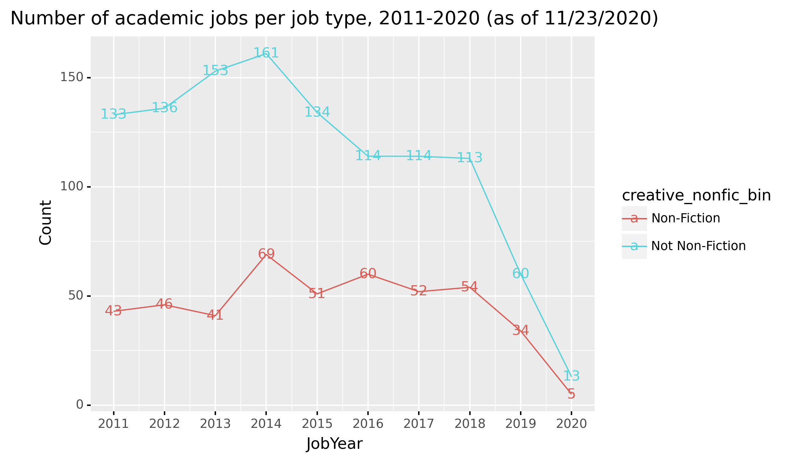

# jobcensus
Academic job census for the humanities

## Origin

How many jobs are offered each year in the humanities? Surprisingly, we don't exactly know. In literature, we do have the [MLA Job Report](mla/reports/Job List_2018-19_Linked.pdf), but this hasn't been updated in the last couple years. The discipline is changing -- and collapsing -- more quickly than that. This "census" is meant to be an informal count of the jobs advertised each year, using the [Academic Jobs Wiki](https://academicjobs.wikia.org/) as its primary source. Last November, this method [showed a steep decline](https://twitter.com/quadrismegistus/status/1196462662101680128) in the number of jobs, especially since 2017. This November (2020), the fall has continued.

## Results

### 1. Number of jobs overall

### 2. Number of jobs by type

### 3. Number of jobs by field (top 10)

### 4. Number of jobs by field (all)

## Code

1. [Run the numbers on the Wiki](wiki/wiki_jobcensus.ipynb)

2. [Parse the MLA JIL emails](mla/mla_jobcensus.ipynb)

3. [Synthesize the data](synthesis/synthesize.ipynb)

4. [Manual process: Give aliases to fields](synthesis/data.jobcensus.field_aliases.csv)

5. [Plot results](plot/plotjobs.ipynb)

## Sources

1. [Academic Jobs Wiki](https://academicjobs.wikia.org/)
    * Pages linked to from:
        * English Literature: [2011](https://academicjobs.wikia.org/wiki/English_Literature_2011-2012) | [2012](https://academicjobs.wikia.org/wiki/English_Literature_2012-2013) | [2013](https://academicjobs.wikia.org/wiki/English_Literature_2013-14) | [2014](https://academicjobs.wikia.org/wiki/English_Literature_2014-2015) | [2015](https://academicjobs.wikia.org/wiki/English_Literature_2015-2016) | [2016](https://academicjobs.wikia.org/wiki/English_Literature_2016-2017) | [2017](https://academicjobs.wikia.org/wiki/English_Literature_2017-2018) | [2018](https://academicjobs.wikia.org/wiki/English_Literature_2018-2019) | [2019](https://academicjobs.wikia.org/wiki/English_Literature_2019-2020) | [2020](https://academicjobs.wikia.org/wiki/English_Literature_2020-2021) | [2020](https://academicjobs.wikia.org/wiki/English_Literature_2020-2021)
        * Ethnic Studies (now its own page): [2020](https://academicjobs.wikia.org/wiki/Ethnic_Studies_2020-2021)
        
    * Those pages are:
        * 20-21 c. American: [2011](https://academicjobs.wikia.org/wiki/20-21_c._American_2011) | [2012](https://academicjobs.wikia.org/wiki/20-21_c._American_2012) | [2014](https://academicjobs.wikia.org/wiki/20-21_c._American_2014) | [2015](https://academicjobs.wikia.org/wiki/20-21_c._American_2015) | [2016](https://academicjobs.wikia.org/wiki/20-21_c._American_2016) | [2017](https://academicjobs.wikia.org/wiki/20-21_c._American_2017) | [2018](https://academicjobs.wikia.org/wiki/20-21_c._American_2018) | [2019](https://academicjobs.wikia.org/wiki/20-21_c._American_2019)
        * 20th and 21st-Century American: [2019](https://academicjobs.wikia.org/wiki/20th_and_21st-Century_American_2019-2020) | [2020](https://academicjobs.wikia.org/wiki/20th_and_21st-Century_American_2020-2021)
        * African & African American Studies: [2020](https://academicjobs.wikia.org/wiki/African_%26_African_American_Studies_2020-2021)
        * African American: [2011](https://academicjobs.wikia.org/wiki/African_American_2011) | [2012](https://academicjobs.wikia.org/wiki/African_American_2012) | [2014](https://academicjobs.wikia.org/wiki/African_American_2014) | [2015](https://academicjobs.wikia.org/wiki/African_American_2015) | [2016](https://academicjobs.wikia.org/wiki/African_American_2016) | [2017](https://academicjobs.wikia.org/wiki/African_American_2017) | [2018](https://academicjobs.wikia.org/wiki/African_American_2018) | [2019](https://academicjobs.wikia.org/wiki/African_American_2019)
        * African American Literature: [2020](https://academicjobs.wikia.org/wiki/African_American_Literature_2020-2021)
        * American Open: [2011](https://academicjobs.wikia.org/wiki/American_Open_2011) | [2012](https://academicjobs.wikia.org/wiki/American_Open_2012) | [2014](https://academicjobs.wikia.org/wiki/American_Open_2014) | [2015](https://academicjobs.wikia.org/wiki/American_Open_2015) | [2016](https://academicjobs.wikia.org/wiki/American_Open_2016) | [2017](https://academicjobs.wikia.org/wiki/American_Open_2017) | [2018](https://academicjobs.wikia.org/wiki/American_Open_2018) | [2019](https://academicjobs.wikia.org/wiki/American_Open_2019) | [2019](https://academicjobs.wikia.org/wiki/American_Open_2019-2020) | [2020](https://academicjobs.wikia.org/wiki/American_Open_2020-2021)
        * American Regional: [2019](https://academicjobs.wikia.org/wiki/American_Regional_2019-2020)
        * American Studies: [2020](https://academicjobs.wikia.org/wiki/American_Studies_2020-2021)
        * Anglophone: [2011](https://academicjobs.wikia.org/wiki/Anglophone_2011) | [2012](https://academicjobs.wikia.org/wiki/Anglophone_2012) | [2014](https://academicjobs.wikia.org/wiki/Anglophone_2014) | [2015](https://academicjobs.wikia.org/wiki/Anglophone_2015) | [2016](https://academicjobs.wikia.org/wiki/Anglophone_2016) | [2017](https://academicjobs.wikia.org/wiki/Anglophone_2017) | [2018](https://academicjobs.wikia.org/wiki/Anglophone_2018) | [2019](https://academicjobs.wikia.org/wiki/Anglophone_2019)
        * Anglophone and World Literature / Postcolonial: [2019](https://academicjobs.wikia.org/wiki/Anglophone_and_World_Literature_/_Postcolonial_2019-2020) | [2020](https://academicjobs.wikia.org/wiki/Anglophone_and_World_Literature_/_Postcolonial_2020-2021)
        * Applied Linguistics/TESOL: [2019](https://academicjobs.wikia.org/wiki/Applied_Linguistics/TESOL_2019-2020) | [2020](https://academicjobs.wikia.org/wiki/Applied_Linguistics/TESOL_2020-2021)
        * Asian & Asian American Studies: [2020](https://academicjobs.wikia.org/wiki/Asian_%26_Asian_American_Studies_2020-2021)
        * British Open: [2011](https://academicjobs.wikia.org/wiki/British_Open_2011) | [2012](https://academicjobs.wikia.org/wiki/British_Open_2012) | [2014](https://academicjobs.wikia.org/wiki/British_Open_2014) | [2015](https://academicjobs.wikia.org/wiki/British_Open_2015) | [2016](https://academicjobs.wikia.org/wiki/British_Open_2016) | [2017](https://academicjobs.wikia.org/wiki/British_Open_2017) | [2018](https://academicjobs.wikia.org/wiki/British_Open_2018) | [2019](https://academicjobs.wikia.org/wiki/British_Open_2019) | [2019](https://academicjobs.wikia.org/wiki/British_Open_2019-2020) | [2020](https://academicjobs.wikia.org/wiki/British_Open_2020-2021)
        * Canadian: [2011](https://academicjobs.wikia.org/wiki/Canadian_2011) | [2012](https://academicjobs.wikia.org/wiki/Canadian_2012) | [2014](https://academicjobs.wikia.org/wiki/Canadian_2014) | [2015](https://academicjobs.wikia.org/wiki/Canadian_2015) | [2017](https://academicjobs.wikia.org/wiki/Canadian_2017) | [2019](https://academicjobs.wikia.org/wiki/Canadian_2019)
        * Canadian Literature: [2019](https://academicjobs.wikia.org/wiki/Canadian_Literature_2019-2020)
        * Chicanx & Latinx Studies: [2020](https://academicjobs.wikia.org/wiki/Chicanx_%26_Latinx_Studies_2020-2021)
        * Children's: [2011](https://academicjobs.wikia.org/wiki/Children%27s_2011) | [2012](https://academicjobs.wikia.org/wiki/Children%27s_2012) | [2014](https://academicjobs.wikia.org/wiki/Children%27s_2014) | [2015](https://academicjobs.wikia.org/wiki/Children%27s_2015) | [2016](https://academicjobs.wikia.org/wiki/Children%27s_2016) | [2017](https://academicjobs.wikia.org/wiki/Children%27s_2017) | [2018](https://academicjobs.wikia.org/wiki/Children%27s_2018) | [2019](https://academicjobs.wikia.org/wiki/Children%27s_2019)
        * Children's and Young Adult: [2019](https://academicjobs.wikia.org/wiki/Children%27s_and_Young_Adult_2019-2020) | [2020](https://academicjobs.wikia.org/wiki/Children%27s_and_Young_Adult_2020-2021)
        * Classics: [2019](https://academicjobs.wikia.org/wiki/Classics_2019-2020) | [2020](https://academicjobs.wikia.org/wiki/Classics_2020-2021)
        * Communication and Media Studies: [2020](https://academicjobs.wikia.org/wiki/Communication_and_Media_Studies_2020-2021)
        * Community Colleges: [2011](https://academicjobs.wikia.org/wiki/Community_Colleges_2011) | [2012](https://academicjobs.wikia.org/wiki/Community_Colleges_2012) | [2014](https://academicjobs.wikia.org/wiki/Community_Colleges_2014) | [2015](https://academicjobs.wikia.org/wiki/Community_Colleges_2015) | [2016](https://academicjobs.wikia.org/wiki/Community_Colleges_2016) | [2017](https://academicjobs.wikia.org/wiki/Community_Colleges_2017) | [2018](https://academicjobs.wikia.org/wiki/Community_Colleges_2018) | [2019](https://academicjobs.wikia.org/wiki/Community_Colleges_2019) | [2019](https://academicjobs.wikia.org/wiki/Community_Colleges_2019-2020) | [2020](https://academicjobs.wikia.org/wiki/Community_Colleges_2020-2021)
        * Comparative: [2011](https://academicjobs.wikia.org/wiki/Comparative_2011) | [2012](https://academicjobs.wikia.org/wiki/Comparative_2012) | [2014](https://academicjobs.wikia.org/wiki/Comparative_2014) | [2015](https://academicjobs.wikia.org/wiki/Comparative_2015) | [2016](https://academicjobs.wikia.org/wiki/Comparative_2016) | [2017](https://academicjobs.wikia.org/wiki/Comparative_2017) | [2018](https://academicjobs.wikia.org/wiki/Comparative_2018) | [2019](https://academicjobs.wikia.org/wiki/Comparative_2019)
        * Comparative Literature: [2019](https://academicjobs.wikia.org/wiki/Comparative_Literature_2019-2020) | [2020](https://academicjobs.wikia.org/wiki/Comparative_Literature_2020-2021)
        * Creative Writing: [2019](https://academicjobs.wikia.org/wiki/Creative_Writing_2019) | [2019](https://academicjobs.wikia.org/wiki/Creative_Writing_2019-2020) | [2021](https://academicjobs.wikia.org/wiki/Creative_Writing_2021)
        * CreativeWriting: [2011](https://academicjobs.wikia.org/wiki/CreativeWriting_2011) | [2012](https://academicjobs.wikia.org/wiki/CreativeWriting_2012) | [2014](https://academicjobs.wikia.org/wiki/CreativeWriting_2014) | [2015](https://academicjobs.wikia.org/wiki/CreativeWriting_2015) | [2016](https://academicjobs.wikia.org/wiki/CreativeWriting_2016) | [2017](https://academicjobs.wikia.org/wiki/CreativeWriting_2017) | [2018](https://academicjobs.wikia.org/wiki/CreativeWriting_2018)
        * Critical Theory: [2019](https://academicjobs.wikia.org/wiki/Critical_Theory_2019-2020) | [2020](https://academicjobs.wikia.org/wiki/Critical_Theory_2020-2021)
        * Drama, Speech, Film & New Media: [2011](https://academicjobs.wikia.org/wiki/Drama,_Speech,_Film_%26_New_Media_2011)
        * Early American: [2011](https://academicjobs.wikia.org/wiki/Early_American_2011) | [2012](https://academicjobs.wikia.org/wiki/Early_American_2012) | [2014](https://academicjobs.wikia.org/wiki/Early_American_2014) | [2015](https://academicjobs.wikia.org/wiki/Early_American_2015) | [2016](https://academicjobs.wikia.org/wiki/Early_American_2016) | [2017](https://academicjobs.wikia.org/wiki/Early_American_2017) | [2018](https://academicjobs.wikia.org/wiki/Early_American_2018) | [2019](https://academicjobs.wikia.org/wiki/Early_American_2019)
        * Early Modern / Renaissance: [2019](https://academicjobs.wikia.org/wiki/Early_Modern_/_Renaissance_2019-2020) | [2020](https://academicjobs.wikia.org/wiki/Early_Modern_/_Renaissance_2020-2021)
        * Early and 19th-Century American: [2019](https://academicjobs.wikia.org/wiki/Early_and_19th-Century_American_2019-2020) | [2020](https://academicjobs.wikia.org/wiki/Early_and_19th-Century_American_2020-2021)
        * East Asian Studies, Languages, and Literatures: [2020](https://academicjobs.wikia.org/wiki/East_Asian_Studies,_Languages,_and_Literatures_2020-2021)
        * Eastern European & Eurasian Languages & Literatures: [2020](https://academicjobs.wikia.org/wiki/Eastern_European_%26_Eurasian_Languages_%26_Literatures_2020-2021)
        * English Education / Primary and Secondary Literacy: [2019](https://academicjobs.wikia.org/wiki/English_Education_/_Primary_and_Secondary_Literacy_2019-2020) | [2020](https://academicjobs.wikia.org/wiki/English_Education_/_Primary_and_Secondary_Literacy_2020-2021)
        * English Lit Salaries: [2011](https://academicjobs.wikia.org/wiki/English_Lit_Salaries_2011-2012) | [2012](https://academicjobs.wikia.org/wiki/English_Lit_Salaries_2012-13) | [2019](https://academicjobs.wikia.org/wiki/English_Lit_Salaries_2019-2020) | [2020](https://academicjobs.wikia.org/wiki/English_Lit_Salaries_2020-2021)
        * English Lit Salaries for AY: [2014](https://academicjobs.wikia.org/wiki/English_Lit_Salaries_for_AY_2014-2015) | [2015](https://academicjobs.wikia.org/wiki/English_Lit_Salaries_for_AY_2015-2016) | [2016](https://academicjobs.wikia.org/wiki/English_Lit_Salaries_for_AY_2016-2017) | [2017](https://academicjobs.wikia.org/wiki/English_Lit_Salaries_for_AY_2017-2018)
        * English Literature: [2012](https://academicjobs.wikia.org/wiki/English_Literature_2012-2013) | [2013](https://academicjobs.wikia.org/wiki/English_Literature_2013) | [2014](https://academicjobs.wikia.org/wiki/English_Literature_2014-2015) | [2015](https://academicjobs.wikia.org/wiki/English_Literature_2015-2016) | [2016](https://academicjobs.wikia.org/wiki/English_Literature_2016-2017) | [2017](https://academicjobs.wikia.org/wiki/English_Literature_2017-2018) | [2018](https://academicjobs.wikia.org/wiki/English_Literature_2018-2019) | [2020](https://academicjobs.wikia.org/wiki/English_Literature_2020-2021)
        * Environmental: [2011](https://academicjobs.wikia.org/wiki/Environmental_2011) | [2012](https://academicjobs.wikia.org/wiki/Environmental_2012) | [2014](https://academicjobs.wikia.org/wiki/Environmental_2014) | [2015](https://academicjobs.wikia.org/wiki/Environmental_2015) | [2016](https://academicjobs.wikia.org/wiki/Environmental_2016) | [2017](https://academicjobs.wikia.org/wiki/Environmental_2017) | [2018](https://academicjobs.wikia.org/wiki/Environmental_2018) | [2019](https://academicjobs.wikia.org/wiki/Environmental_2019)
        * Environmental Literature: [2019](https://academicjobs.wikia.org/wiki/Environmental_Literature_2019-2020) | [2020](https://academicjobs.wikia.org/wiki/Environmental_Literature_2020-2021)
        * Ethnic American Literature: [2019](https://academicjobs.wikia.org/wiki/Ethnic_American_Literature_2019)
        * Ethnic Studies: [2019](https://academicjobs.wikia.org/wiki/Ethnic_Studies_2019-2020) | [2020](https://academicjobs.wikia.org/wiki/Ethnic_Studies_2020-2021)
        * Film Studies: [2013](https://academicjobs.wikia.org/wiki/Film_Studies_2013-2014) | [2014](https://academicjobs.wikia.org/wiki/Film_Studies_2014-2015) | [2015](https://academicjobs.wikia.org/wiki/Film_Studies_2015-2016) | [2016](https://academicjobs.wikia.org/wiki/Film_Studies_2016-2017) | [2017](https://academicjobs.wikia.org/wiki/Film_Studies_2017-2018) | [2018](https://academicjobs.wikia.org/wiki/Film_Studies_2018-2019) | [2019](https://academicjobs.wikia.org/wiki/Film_Studies_2019-2020) | [2020](https://academicjobs.wikia.org/wiki/Film_Studies_2020-2021)
        * French & Francophone: [2020](https://academicjobs.wikia.org/wiki/French_%26_Francophone_2020-2021)
        * Generalist: [2011](https://academicjobs.wikia.org/wiki/Generalist_2011) | [2012](https://academicjobs.wikia.org/wiki/Generalist_2012) | [2014](https://academicjobs.wikia.org/wiki/Generalist_2014) | [2015](https://academicjobs.wikia.org/wiki/Generalist_2015) | [2016](https://academicjobs.wikia.org/wiki/Generalist_2016) | [2017](https://academicjobs.wikia.org/wiki/Generalist_2017) | [2018](https://academicjobs.wikia.org/wiki/Generalist_2018) | [2019](https://academicjobs.wikia.org/wiki/Generalist_2019)
        * Generalist and Open: [2019](https://academicjobs.wikia.org/wiki/Generalist_and_Open_2019-2020) | [2020](https://academicjobs.wikia.org/wiki/Generalist_and_Open_2020-2021)
        * German: [2020](https://academicjobs.wikia.org/wiki/German_2020-2021)
        * Humanities and Social Sciences Postdocs: [2013](https://academicjobs.wikia.org/wiki/Humanities_and_Social_Sciences_Postdocs_2013-14) | [2014](https://academicjobs.wikia.org/wiki/Humanities_and_Social_Sciences_Postdocs_2014-15) | [2015](https://academicjobs.wikia.org/wiki/Humanities_and_Social_Sciences_Postdocs_2015-16) | [2016](https://academicjobs.wikia.org/wiki/Humanities_and_Social_Sciences_Postdocs_2016-17) | [2017](https://academicjobs.wikia.org/wiki/Humanities_and_Social_Sciences_Postdocs_2017-18) | [2018](https://academicjobs.wikia.org/wiki/Humanities_and_Social_Sciences_Postdocs_2018-2019) | [2019](https://academicjobs.wikia.org/wiki/Humanities_and_Social_Sciences_Postdocs_2019-2020) | [2020](https://academicjobs.wikia.org/wiki/Humanities_and_Social_Sciences_Postdocs_2020-2021)
        * Irish: [2011](https://academicjobs.wikia.org/wiki/Irish_2011) | [2012](https://academicjobs.wikia.org/wiki/Irish_2012) | [2014](https://academicjobs.wikia.org/wiki/Irish_2014) | [2015](https://academicjobs.wikia.org/wiki/Irish_2015) | [2018](https://academicjobs.wikia.org/wiki/Irish_2018)
        * Irish, Scottish, or Welsh Literature: [2019](https://academicjobs.wikia.org/wiki/Irish,_Scottish,_or_Welsh_Literature_2019-2020) | [2020](https://academicjobs.wikia.org/wiki/Irish,_Scottish,_or_Welsh_Literature_2020-2021)
        * Italian: [2020](https://academicjobs.wikia.org/wiki/Italian_2020-2021)
        * Jewish Studies: [2019](https://academicjobs.wikia.org/wiki/Jewish_Studies_2019-2020) | [2020](https://academicjobs.wikia.org/wiki/Jewish_Studies_2020-2021)
        * Linguistics: [2013](https://academicjobs.wikia.org/wiki/Linguistics_2013-2014) | [2014](https://academicjobs.wikia.org/wiki/Linguistics_2014-2015) | [2015](https://academicjobs.wikia.org/wiki/Linguistics_2015-2016) | [2016](https://academicjobs.wikia.org/wiki/Linguistics_2016-2017) | [2017](https://academicjobs.wikia.org/wiki/Linguistics_2017-2018) | [2018](https://academicjobs.wikia.org/wiki/Linguistics_2018-2019) | [2019](https://academicjobs.wikia.org/wiki/Linguistics_2019-2020) | [2020](https://academicjobs.wikia.org/wiki/Linguistics_2020-2021)
        * Medieval: [2011](https://academicjobs.wikia.org/wiki/Medieval_2011) | [2012](https://academicjobs.wikia.org/wiki/Medieval_2012) | [2014](https://academicjobs.wikia.org/wiki/Medieval_2014) | [2015](https://academicjobs.wikia.org/wiki/Medieval_2015) | [2016](https://academicjobs.wikia.org/wiki/Medieval_2016) | [2017](https://academicjobs.wikia.org/wiki/Medieval_2017) | [2018](https://academicjobs.wikia.org/wiki/Medieval_2018) | [2019](https://academicjobs.wikia.org/wiki/Medieval_2019) | [2019](https://academicjobs.wikia.org/wiki/Medieval_2019-2020) | [2020](https://academicjobs.wikia.org/wiki/Medieval_2020-2021)
        * Middle Eastern Studies & Languages: [2020](https://academicjobs.wikia.org/wiki/Middle_Eastern_Studies_%26_Languages_2020-2021)
        * Modern British: [2011](https://academicjobs.wikia.org/wiki/Modern_British_2011) | [2012](https://academicjobs.wikia.org/wiki/Modern_British_2012) | [2014](https://academicjobs.wikia.org/wiki/Modern_British_2014) | [2015](https://academicjobs.wikia.org/wiki/Modern_British_2015) | [2016](https://academicjobs.wikia.org/wiki/Modern_British_2016) | [2017](https://academicjobs.wikia.org/wiki/Modern_British_2017) | [2018](https://academicjobs.wikia.org/wiki/Modern_British_2018) | [2019](https://academicjobs.wikia.org/wiki/Modern_British_2019)
        * Modern and Contemporary British: [2019](https://academicjobs.wikia.org/wiki/Modern_and_Contemporary_British_2019-2020) | [2020](https://academicjobs.wikia.org/wiki/Modern_and_Contemporary_British_2020-2021)
        * Musicology/Ethnomusicology: [2020](https://academicjobs.wikia.org/wiki/Musicology/Ethnomusicology_2020-21)
        * Native American Studies: [2020](https://academicjobs.wikia.org/wiki/Native_American_Studies_2020-2021)
        * New Media and Digital Humanities: [2014](https://academicjobs.wikia.org/wiki/New_Media_and_Digital_Humanities_2014) | [2015](https://academicjobs.wikia.org/wiki/New_Media_and_Digital_Humanities_2015) | [2016](https://academicjobs.wikia.org/wiki/New_Media_and_Digital_Humanities_2016) | [2017](https://academicjobs.wikia.org/wiki/New_Media_and_Digital_Humanities_2017) | [2018](https://academicjobs.wikia.org/wiki/New_Media_and_Digital_Humanities_2018) | [2019](https://academicjobs.wikia.org/wiki/New_Media_and_Digital_Humanities_2019) | [2019](https://academicjobs.wikia.org/wiki/New_Media_and_Digital_Humanities_2019-2020) | [2020](https://academicjobs.wikia.org/wiki/New_Media_and_Digital_Humanities_2020-2021)
        * North American Regional: [2020](https://academicjobs.wikia.org/wiki/North_American_Regional_2020-2021)
        * Northern European Studies & Languages: [2020](https://academicjobs.wikia.org/wiki/Northern_European_Studies_%26_Languages_2020-2021)
        * Other Ethnic American: [2011](https://academicjobs.wikia.org/wiki/Other_Ethnic_American_2011) | [2012](https://academicjobs.wikia.org/wiki/Other_Ethnic_American_2012) | [2014](https://academicjobs.wikia.org/wiki/Other_Ethnic_American_2014) | [2015](https://academicjobs.wikia.org/wiki/Other_Ethnic_American_2015) | [2016](https://academicjobs.wikia.org/wiki/Other_Ethnic_American_2016) | [2017](https://academicjobs.wikia.org/wiki/Other_Ethnic_American_2017) | [2018](https://academicjobs.wikia.org/wiki/Other_Ethnic_American_2018)
        * Philosophy: [2020](https://academicjobs.wikia.org/wiki/Philosophy_2020-2021)
        * Piano: [2020](https://academicjobs.wikia.org/wiki/Piano_2020-21)
        * Poetry: [2020](https://academicjobs.wikia.org/wiki/Poetry_2020-2021)
        * Queer/Women's/Gender Studies: [2012](https://academicjobs.wikia.org/wiki/Queer/Women%27s/Gender_Studies_2012) | [2014](https://academicjobs.wikia.org/wiki/Queer/Women%27s/Gender_Studies_2014) | [2015](https://academicjobs.wikia.org/wiki/Queer/Women%27s/Gender_Studies_2015) | [2019](https://academicjobs.wikia.org/wiki/Queer/Women%27s/Gender_Studies_2019-2020) | [2020](https://academicjobs.wikia.org/wiki/Queer/Women%27s/Gender_Studies_2020-2021)
        * Renaissance: [2011](https://academicjobs.wikia.org/wiki/Renaissance_2011) | [2012](https://academicjobs.wikia.org/wiki/Renaissance_2012) | [2014](https://academicjobs.wikia.org/wiki/Renaissance_2014) | [2015](https://academicjobs.wikia.org/wiki/Renaissance_2015) | [2016](https://academicjobs.wikia.org/wiki/Renaissance_2016) | [2017](https://academicjobs.wikia.org/wiki/Renaissance_2017) | [2018](https://academicjobs.wikia.org/wiki/Renaissance_2018) | [2019](https://academicjobs.wikia.org/wiki/Renaissance_2019)
        * Restoration / 18th Century British: [2019](https://academicjobs.wikia.org/wiki/Restoration_/_18th_Century_British_2019-2020) | [2020](https://academicjobs.wikia.org/wiki/Restoration_/_18th_Century_British_2020-2021)
        * Restoration/18th-Century: [2011](https://academicjobs.wikia.org/wiki/Restoration/18th-Century_2011) | [2012](https://academicjobs.wikia.org/wiki/Restoration/18th-Century_2012) | [2014](https://academicjobs.wikia.org/wiki/Restoration/18th-Century_2014) | [2015](https://academicjobs.wikia.org/wiki/Restoration/18th-Century_2015) | [2016](https://academicjobs.wikia.org/wiki/Restoration/18th-Century_2016) | [2017](https://academicjobs.wikia.org/wiki/Restoration/18th-Century_2017) | [2018](https://academicjobs.wikia.org/wiki/Restoration/18th-Century_2018) | [2019](https://academicjobs.wikia.org/wiki/Restoration/18th-Century_2019)
        * Rhetoric/Composition: [2011](https://academicjobs.wikia.org/wiki/Rhetoric/Composition_2011) | [2012](https://academicjobs.wikia.org/wiki/Rhetoric/Composition_2012) | [2014](https://academicjobs.wikia.org/wiki/Rhetoric/Composition_2014) | [2015](https://academicjobs.wikia.org/wiki/Rhetoric/Composition_2015) | [2016](https://academicjobs.wikia.org/wiki/Rhetoric/Composition_2016) | [2017](https://academicjobs.wikia.org/wiki/Rhetoric/Composition_2017) | [2018](https://academicjobs.wikia.org/wiki/Rhetoric/Composition_2018) | [2019](https://academicjobs.wikia.org/wiki/Rhetoric/Composition_2019) | [2020](https://academicjobs.wikia.org/wiki/Rhetoric/Composition_2020) | [2020](https://academicjobs.wikia.org/wiki/Rhetoric/Composition_2020-2021)
        * Rhetoric/Composition Salaries for AY: [2014](https://academicjobs.wikia.org/wiki/Rhetoric/Composition_Salaries_for_AY_2014-15)
        * Romanticism / Victorian / 19th Century British: [2019](https://academicjobs.wikia.org/wiki/Romanticism_/_Victorian_/_19th_Century_British_2019-2020) | [2020](https://academicjobs.wikia.org/wiki/Romanticism_/_Victorian_/_19th_Century_British_2020-2021)
        * Romanticism, Victorian/19th: [2011](https://academicjobs.wikia.org/wiki/Romanticism,_Victorian/19th_2011) | [2012](https://academicjobs.wikia.org/wiki/Romanticism,_Victorian/19th_2012)
        * Romanticism/Victorian/19th: [2014](https://academicjobs.wikia.org/wiki/Romanticism/Victorian/19th_2014) | [2015](https://academicjobs.wikia.org/wiki/Romanticism/Victorian/19th_2015) | [2016](https://academicjobs.wikia.org/wiki/Romanticism/Victorian/19th_2016) | [2017](https://academicjobs.wikia.org/wiki/Romanticism/Victorian/19th_2017) | [2018](https://academicjobs.wikia.org/wiki/Romanticism/Victorian/19th_2018) | [2019](https://academicjobs.wikia.org/wiki/Romanticism/Victorian/19th_2019)
        * Social Work: [2020](https://academicjobs.wikia.org/wiki/Social_Work_2020-2021)
        * South Asian, Indian Ocean, & Himalayan Studies & Languages: [2020](https://academicjobs.wikia.org/wiki/South_Asian,_Indian_Ocean,_%26_Himalayan_Studies_%26_Languages_2020-2021)
        * Southern: [2014](https://academicjobs.wikia.org/wiki/Southern_2014) | [2015](https://academicjobs.wikia.org/wiki/Southern_2015) | [2016](https://academicjobs.wikia.org/wiki/Southern_2016)
        * Spanish and Portuguese: [2020](https://academicjobs.wikia.org/wiki/Spanish_and_Portuguese_2020-2021)
        * TESOL / Applied Linguistics: [2012](https://academicjobs.wikia.org/wiki/TESOL_/_Applied_Linguistics_2012)
        * Theatre: [2013](https://academicjobs.wikia.org/wiki/Theatre_2013-14) | [2014](https://academicjobs.wikia.org/wiki/Theatre_2014-2015) | [2015](https://academicjobs.wikia.org/wiki/Theatre_2015-2016) | [2016](https://academicjobs.wikia.org/wiki/Theatre_2016-2017) | [2017](https://academicjobs.wikia.org/wiki/Theatre_2017-2018) | [2018](https://academicjobs.wikia.org/wiki/Theatre_2018-2019)
        * Theatre / Drama: [2019](https://academicjobs.wikia.org/wiki/Theatre_/_Drama_2019-2020) | [2020](https://academicjobs.wikia.org/wiki/Theatre_/_Drama_2020-2021)
        * Theory: [2011](https://academicjobs.wikia.org/wiki/Theory_2011) | [2012](https://academicjobs.wikia.org/wiki/Theory_2012) | [2014](https://academicjobs.wikia.org/wiki/Theory_2014) | [2015](https://academicjobs.wikia.org/wiki/Theory_2015) | [2016](https://academicjobs.wikia.org/wiki/Theory_2016) | [2017](https://academicjobs.wikia.org/wiki/Theory_2017) | [2018](https://academicjobs.wikia.org/wiki/Theory_2018) | [2019](https://academicjobs.wikia.org/wiki/Theory_2019)
        * Translation Studies: [2019](https://academicjobs.wikia.org/wiki/Translation_Studies_2019-2020) | [2020](https://academicjobs.wikia.org/wiki/Translation_Studies_2020-2021)
        * Womens/Gender/Queer Studies: [2015](https://academicjobs.wikia.org/wiki/Womens/Gender/Queer_Studies_2015-2016) | [2016](https://academicjobs.wikia.org/wiki/Womens/Gender/Queer_Studies_2016-2017) | [2017](https://academicjobs.wikia.org/wiki/Womens/Gender/Queer_Studies_2017-2018) | [2018](https://academicjobs.wikia.org/wiki/Womens/Gender/Queer_Studies_2018-2019)
2. MLA JIL (2020-2021)
    * Collected by [Ben Schmidt](https://github.com/bmschmidt)

